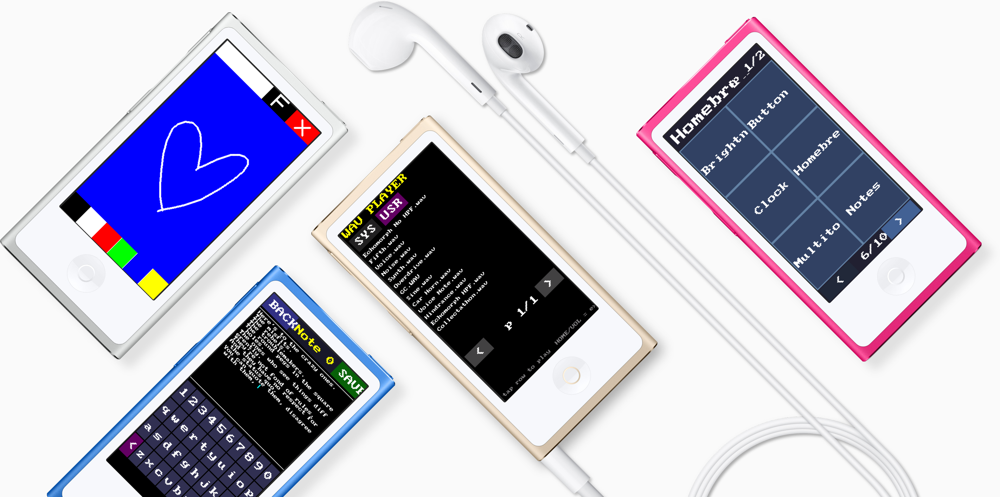

# NanoApps

**Run custom homebrew apps on iPod nano 7th generation.**

NanoApps is an early developer preview for hobbyists and tinkerers who want to build and run custom apps for iPod nano 7th generation. This is the very beginning of custom apps on nano: it needs a lot more research and polish before it can become a daily-driver app platform, but early results are promising, allowing you to run basic versions of [Paint](screenshots/NanoApps_Paint.png), [Notes](screenshots/NanoApps_Notes.png), [WAV Player](screenshots/NanoApps_WAV_Player.png), and [Homebrew Launcher](screenshots/NanoApps_Launcher.png) on nano today. Contributions are very welcome; see [Contributing to NanoApps](#contributing-to-nanoapps), join the [iPod nano Hacking Discord](https://discord.gg/7PnGEXjW3X), and share what you build on [r/ipod](https://www.reddit.com/r/ipod/).



## What Is Included

NanoApps includes [a small C SDK](sdk/hb_sdk.h), [sample apps](apps), [a launcher infrastructure](apps/launcher/launcher.c), [a custom app bundle format](sdk/hb_app_loader.c), and [Linux/Raspberry Pi tools](tools) for installing and launching apps over the custom SCSI command channel provided by [ipod_sun_untethered](https://github.com/nfzerox/ipod_sun_untethered/releases).

This developer preview includes sample apps like [Paint](apps/paint/paint.c), [Notes](apps/notes/notes.c), [WAV Player](apps/wav_player/wav_player.c), [API Tests](apps/api_tests/api_tests.c), [Clock](apps/clock/clock.c), [Homebrew Launcher](apps/launcher/launcher.c), [Multitouch Test](apps/multitouch_test/multitouch_test.c), [Hardware Button Test](apps/button_test/button_test.c), [Brightness Test](apps/brightness_test/brightness_test.c), [Filesystem Demos](apps/fs_ls/fs_ls.c), and [Font Test](apps/font_test/font_test.c).

Supported iPod features so far include [accelerometer](sdk/hb_accel.c), [.wav audio playback (unstable)](sdk/hb_audio.c), [brightness](sdk/hb_brightness.c), [battery](sdk/hb_battery.c), [hardware buttons](sdk/hb_button.c), [clock](sdk/hb_rtc.c), [display](sdk/hb_mipi.c), [filesystem](sdk/hb_fs.c), [multitouch](sdk/hb_touch.c), and [settings](sdk/hb_settings.c). You need a Linux machine to use [the current SCSI workflow](tools). This is tested on Raspberry Pi. [Help is greatly appreciated](#contributing-to-nanoapps) porting SCSI support to Windows and Mac.

## Getting Started

You need:

- [iPod nano 7th generation](https://www.backmarket.com/en-us/search?q=iPod+nano+7)
- [Raspberry Pi](https://www.raspberrypi.com) or another [Linux machine](https://www.debian.org)
- A Windows PC or Mac for flashing iPod firmware

Install common packages on [Raspberry Pi OS](https://www.raspberrypi.com/software/operating-systems/) / [Debian](https://www.debian.org):

```sh
sudo apt update
sudo apt install -y build-essential gcc-arm-none-eabi make sg3-utils curl python3 unzip
```

Clone NanoApps and enter the repo:

```sh
git clone https://github.com/nfzerox/NanoApps.git
cd NanoApps
```

## 1. Flash ipod_sun_untethered

The SCSI command channel comes from ipod_sun_untethered. On a Windows PC, visit the [ipod_sun_untethered releases page](https://github.com/nfzerox/ipod_sun_untethered/releases) in your browser, download the IPSW for your iPod nano 7 model, and restore it with [iTunes](https://www.apple.com/itunes/).

Recommended restore path: restore the iPod using iTunes on Windows so the iPod is FAT32 formatted. Mac-formatted iPods can work, but writing to an HFS formatted iPod from Linux/Raspberry Pi is experimental.

Known Issue: The SCSI command channel installed by ipod_sun_untethered can cause the iPod to panic and reboot when connected to iTunes, Apple Devices, or Finder. After restoring, disconnect the iPod from your Windows PC and connect it to your Raspberry Pi or a Linux machine. 

I found that if you conect it then go into disc mode when it reboots it stops rebooting and you can sync to it without bothering the iPod_Sun. Another way of syncing is to restore to [stock OS](https://theapplewiki.com/wiki/Firmware/iPod#iPod_nano_(7th_generation)) from [DFU mode](https://theapplewiki.com/wiki/DFU_Mode#iPod_nano_(7th_generation)), sync music, then Shift + Click "Check for Update" and choose the [ipod_sun_untethered](https://github.com/nfzerox/ipod_sun_untethered/releases) firmware. When working on homebrew apps, connect your iPod to your Raspberry Pi or Linux machine.

## 2. Try Sample Apps

Connect iPod to Raspberry Pi. Check the disk names:

```sh
lsblk
```

Most setups look like this:

- iPod disk: `/dev/sda`
- iPod data partition: `/dev/sda1`

Install all bundled apps to `/Apps` on the iPod:

```sh
SCSI_DEV=/dev/sda IPOD_PARTITION=/dev/sda1 ./tools/install_apps.sh
```

This builds app bundles into `apps/out/Apps`, mounts the iPod partition, copies everything to `/Apps`, and unmounts it.

Before launching apps or using the filesystem API, eject the iPod so the iPod OS remounts its filesystem:

```sh
SCSI_DEV=/dev/sda ./tools/eject.sh
```

Important: the filesystem API and the launcher only work on-device after the iPod has been ejected out of Connected mode.

After exiting an app, you may have to tap the iPod screen once to see the normal OS recover.

## 3. Homebrew Launcher

You can launch the Homebrew launcher directly over SCSI:

```sh
SCSI_DEV=/dev/sda ./tools/run_launcher.sh
```

Or install the temporary Podcasts hijack for the current boot. You may need to disconnect and reconnect your iPod, since this requires being in "Connected" mode.

```sh
SCSI_DEV=/dev/sda IPOD_PARTITION=/dev/sda1 ./tools/hijack_podcasts.sh
```

After that, tap Podcasts on the iPod home screen to open Homebrew Launcher. The hook is RAM-only and is lost after reboot.

Most sample apps can be quit through the volume keys or the Home button. After quitting a homebrew app, tap the display for OS UI to refresh. Launching apps through the Homebrew launcher is experimental and not fully stable. Apps may be more crash prone than running them directly through SCSI commands in [Developing Apps](#4-developing-apps). If an app was launched from Homebrew via the Podcasts hijack, quitting that app may panic and reboot the device.

## 4. Developing Apps

Build and run one app directly by picking one of the commands.

```sh
SCSI_DEV=/dev/sda ./tools/run_app.sh notes
SCSI_DEV=/dev/sda ./tools/run_app.sh paint
SCSI_DEV=/dev/sda ./tools/run_app.sh wav_player
SCSI_DEV=/dev/sda ./tools/run_app.sh clock
SCSI_DEV=/dev/sda ./tools/run_app.sh api_tests
SCSI_DEV=/dev/sda ./tools/run_app.sh brightness_test
SCSI_DEV=/dev/sda ./tools/run_app.sh button_test
SCSI_DEV=/dev/sda ./tools/run_app.sh counter
SCSI_DEV=/dev/sda ./tools/run_app.sh font_test
SCSI_DEV=/dev/sda ./tools/run_app.sh fs_demo
SCSI_DEV=/dev/sda ./tools/run_app.sh fs_gui
SCSI_DEV=/dev/sda ./tools/run_app.sh fs_ls
SCSI_DEV=/dev/sda ./tools/run_app.sh fs_read
SCSI_DEV=/dev/sda ./tools/run_app.sh fs_test
SCSI_DEV=/dev/sda ./tools/run_app.sh fs_write
SCSI_DEV=/dev/sda ./tools/run_app.sh multitouch_test
SCSI_DEV=/dev/sda ./tools/run_app.sh music_remote
```

Add a new app by copying an existing app folder:

```sh
cp -R apps/counter apps/my_app
mv apps/my_app/counter.c apps/my_app/my_app.c
```

Then edit `apps/my_app/Makefile`:

```make
APP_NAME := my_app
SRCS     := my_app.c
include ../../sdk/hb_app.mk
```

Build it:

```sh
make -C apps/my_app
```

Run it:

```sh
SCSI_DEV=/dev/sda ./tools/run_app.sh my_app
```

## 5. Debug Crashes

Apps can write breadcrumbs to the trace buffer:

```c
hb_trace_reset();
hb_trace_log("BOOT", 0, 0);
hb_trace_log("STEP", 1, 0);
```

After a crash/reboot, dump the trace:

```sh
SCSI_DEV=/dev/sda ./tools/dump_trace.sh
```

For a quick build-run-trace cycle:

```sh
SCSI_DEV=/dev/sda ./tools/trace_crash.sh paint
```

## WAV Player

To use the WAV player, create a /WAV folder on your iPod, copy .wav files over, and launch WAV Player from SCSI or Homebrew Launcher. Tap the "USR" tab to play your .wav files. You can also play sound effects from the system resources partition.
```sh
SCSI_DEV=/dev/sda ./tools/eject.sh
SCSI_DEV=/dev/sda ./tools/run_app.sh wav_player
```

WAV playback is still unreliable and uses workarounds; treat it as experimental.

## App Bundle Format

Apps live in `/Apps`:

```text
/Apps/Paint.app/
  Paint
  Name.txt
  Icon.bmp
```

The executable is a flat binary built by `hb_app.mk`. `Name.txt` is optional and supplies the launcher display name. `Icon.bmp` is not yet supported, and reserved for upcoming launcher UI work.

## Taking Screenshots

The SDK includes an experimental direct-MIPI app screenshot path for Home+Power screenshots of homebrew apps. It is off by default to avoid performance issues when running apps. To enable it, change `#define NANOAPPS_ENABLE_APP_SCREENSHOTS 0` to `#define NANOAPPS_ENABLE_APP_SCREENSHOTS 1` in [hb_screenshot.c](sdk/hb_screenshot.c).

When enabled, Home+Power writes `/appshotNNNN.bmp` using the app's SDK shadow framebuffer. The OS screenshot API is also available as `hb_screenshot_take()`. It can screenshot drawn by the OS underneath our custom apps as `/screenshotNNNN.bmp`.

## Contributing to NanoApps

Good places to start:

- [Build more custom apps](#4-developing-apps) with new functionality. Implement your favorite app or game.
- Improve the [homebrew apps](apps), [launcher UI](apps/launcher/launcher.c), and [font rendering](sdk/hb_font.c), possibly with [LVGL](https://lvgl.io/).
- Improve [gesture and multitouch support](sdk/hb_touch.c), for example event listening instead of polling.
- Reverse engineer more OS APIs for the [homebrew SDK](sdk/hb_sdk.h) and improve SDK reliability.
- Make [audio .wav playback](sdk/hb_audio.c) reliable without fragile workarounds.
- Build more user-friendly installation methods, such as automatic untethered injection into Podcasts or iTunes U.
- Add Windows and Mac development/install support in addition to Linux.

[Pull requests](https://github.com/nfzerox/NanoApps/pulls) are welcome. Fork it, play with it, and discuss with fellow hackers on the [iPod nano Hacking Discord](https://discord.gg/7PnGEXjW3X). If you make something cool, post it, share it on [r/ipod](https://www.reddit.com/r/ipod/) and social media.
